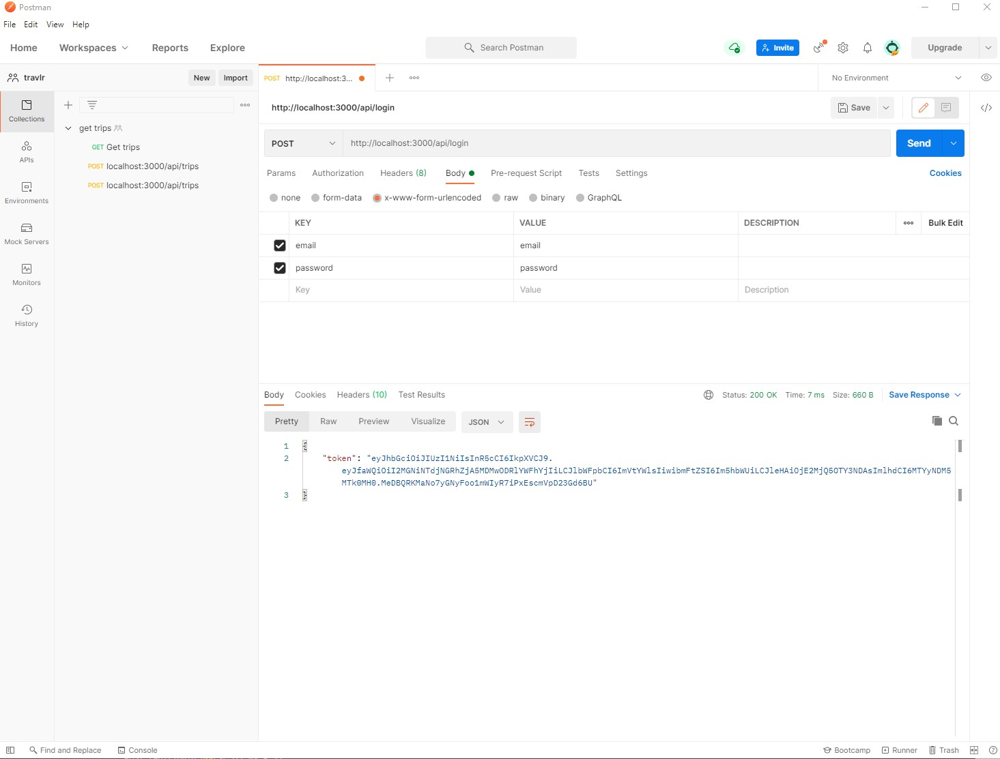
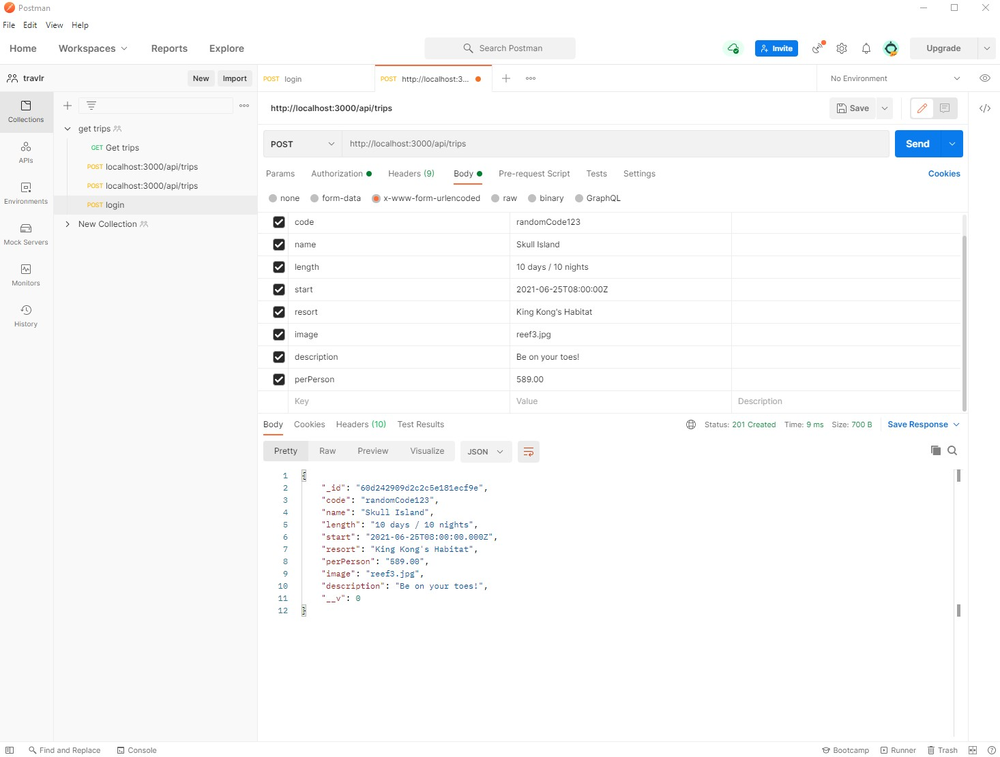
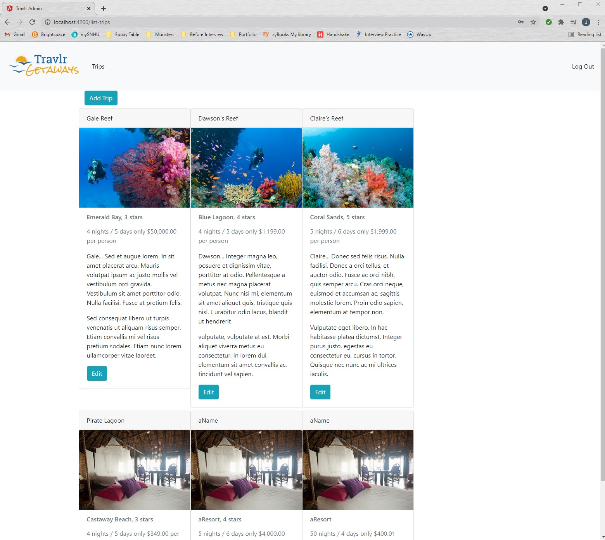
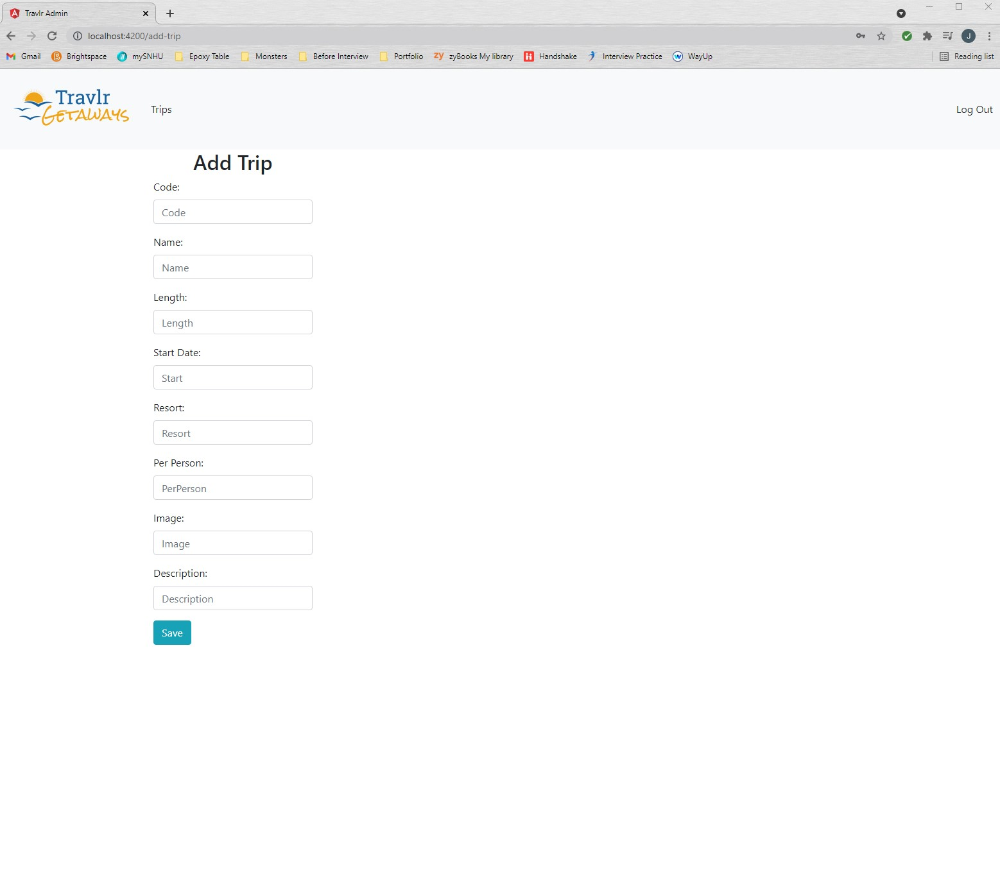
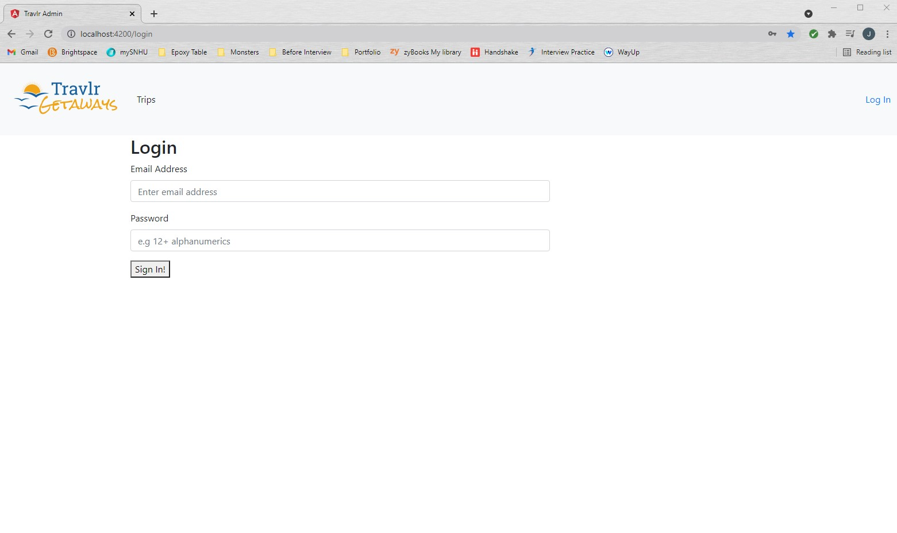

# Travlr

Travlr is a RESTful web application for vacation bookings and reviews. The fictional client, Travlr Getaways, had two userbases: administrators and customers. The customer side was to be content-focused, needed a fast initial load time, and was expected to have a short user duration. On the other hand, the administrator side needed to be feature-focused, required more user interaction, needed a fast and responsive UE instead of a fast initial load time, and required longer user durations.

## Depth of Project

The focus of this project was to create a working prototype of a full stack web application using MEAN technologies and the MVC architectural pattern.

### Backend

Travlr uses Node.js and the Express framework for its web server. Travlr uses a NoSQL database called MongoDB and an object data modeling library called Mongoose.

### Frontend

The frontend that customers interact with uses a templating engine and Express.js so the server can dynamically generate HTML for requests. The administrators' frontend is an SPA delivered via Angular.

### Security

The API endpoints are secured using authentication and authorization schemes that utilize JSON web tokens. When the user's credentials are authenticated, a JWT is issued to their browser's local storage. On the backend, user passwords are stored using one-way encryption and are never stored in plaintext.

## The MEAN Stack

- **MongoDB** - NoSQL databases are known for their speed and flexibility over the more structured SQL relational databases. BSON and JSON are used to develop MongoDB code, which makes it a great candidate for a MEAN stack application which primarily uses JSON and JavaScript
- **Express** - this is a Node.js framework that makes developing Node applications much easier. Express is used in combination with Handlebars to template and dynamically render HTML pages
- **Angular** - this is the frontend framework that allows use of SPAs. With this type of architecture, clients are sent a lot of JavaScript files with the first request and can then generate all the webpages without subsequent server requests. Angular SPAs put less strain on the server and allow for a faster, more responsive user experience after the first web page loads. One downside to this approach is that it will be hard for search engines to crawl the website. Another downside to the SPA approach is that it requires a slow initial page load which may impact the user experience
- **Node.js** - this is the software platform that many modern developers use to create their web server. It is the foundation for building web applications on. JavaScript is the primary programming language used for Node and Express, making the MEAN stack easy to learn because it only requires knowledge in JavaScript

## Screenshots for API Endpoints

## Screenshots for Administrator SPA

## CS-465 Course Specifics

JSON is a data transmission format while JavaScript is a programming language. JSON is used in frontend and backend development by passing HTTP requests containing JSON bodies.

One of the most important code refactors that I performed was securing the API endpoints. Without authentication and authorization with JSON web tokens, all Travlr's database content would have been exposed to anyone.

Full stack development is a valued skill in the tech industry. This project has enhanced my understanding of client/server development, REST APIs, and how to secure web applications. Thus, this course has given me a competitive edge upon graduation.
